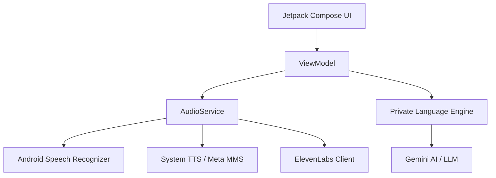

# 🏗️ Native Tutor AI Architecture

This document provides a technical overview of the Native Tutor AI Student App architecture and its integration with the private language engine.

## 🏛️ High-Level Architecture

The app follows a modern Android architectural approach using **Jetpack Compose** for the UI and **MVVM (Model-View-ViewModel)** for state management and business logic separation.

### Component Interaction

## 🧠 Core Components

### 1. Private Language Engine (`ILanguageEngine`)
The "brain" of the app is encapsulated in the `ILanguageEngine` interface. It handles:
- **Evaluation**: Gauging user speech for correctness and cultural nuances.
- **Proactive Logic**: Determining the next prompt to keep the conversation flowing.
- **Thermal Optimization**: Providing optimization levels based on device temperature.

### 2. Audio Service (`AudioService`)
A centralized service for all voice interactions:
- **Speech-to-Text (STT)**: Uses Android's `SpeechRecognizer` with support for local languages (e.g., Hausa `ha-NG`).
- **Text-to-Speech (TTS)**: Hybrid approach using system TTS, Meta MMS for local languages, and ElevenLabs for high-fidelity responses.
- **Mutual Exclusivity**: Ensures the microphone is disabled while the AI is speaking and vice versa.

### 3. Thermal Monitoring (Eco Mode™)
The app integrates with the language engine to monitor NPU/CPU thermal states.
- **Normal**: Full performance.
- **Thermal Warning (39°C)**: UI optimizations and throttling begin.
- **Eco Mode Active (42°C)**: Significant reduction in heavy processing to ensure device safety.

## 📊 Data Flow

1. **User Speaks**: `PulseRecordButton` triggers `AudioService.startListening()`.
2. **Recognition**: STT converts audio to text.
3. **Evaluation**: Text is sent to `HausaTeacherEngine.evaluateSpeech()`.
4. **Feedback**: `EvaluationResult` is returned, containing corrected text and teacher feedback.
5. **Response**: `AudioService` plays the feedback using the appropriate TTS engine.
6. **Proactivity**: `getNextPrompt()` is called to continue the session.

## 🛡️ Security & Privacy
- **API Keys**: Stored in `local.properties` and accessed via `BuildConfig`.
- **Private Logic**: The core AI logic resides in a private repository to protect proprietary cultural data and algorithms.
